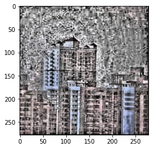

# ACE-Adaptive-Contrast-Enhancement-from-scratch-python
works for both grey-scaled and rgb images

#what is ACE?
ACE or Adaptive Contrast Enhancement iss a method to enhance the contrast of an image, to balance the brightness and darkness of the image. it is a very simple method that uses histogram equalization. this method , gets a pixel of image , and to return its new value , it equlizes histogram of that image and some of that pixels neighbors. and returns the 'histogram-equalized' value specified to that pixel as the new value.
but it is not perfect, why?
because the values for a grid may differ from another. for example a grid need to become very dark to become equalized, and the other needs to become very bright. in this manner the grids borders will be visible and makes the image look segmented.

to use the function you may need to display images in that manner you may need to install plt, or pil ,etc.
to use :
```
image = cv2.imread(path-to-input)
result_ACE = ACE(image, <grid-size>)
plt.imshow(result_ACE)
plt.show()

```

or for grey-scale:

```
image = cv2.imread(path-to-input,0)
result_ACE = ACE(image, <grid-size>)
plt.imshow(result_ACE)
plt.show()

```
here is an input example for colored image and grid size 25

and its output


here is an input example for grey image and grid size 25

and its output

